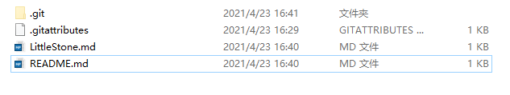

#### H4 Header
[return](README.md)




[external website](https://osu.ppy.sh/users/13960915)


***


```C++
#include  <iostream>
    int main(void)
    {
        cout<<"Hello world";
    }
```

1. one
2. two
3. three

**bolded text**   
*italicized text*   
~~BAIDU.COM~~  
Quote here.
>
> -- <cite>Benjamin Franklin</cite>
